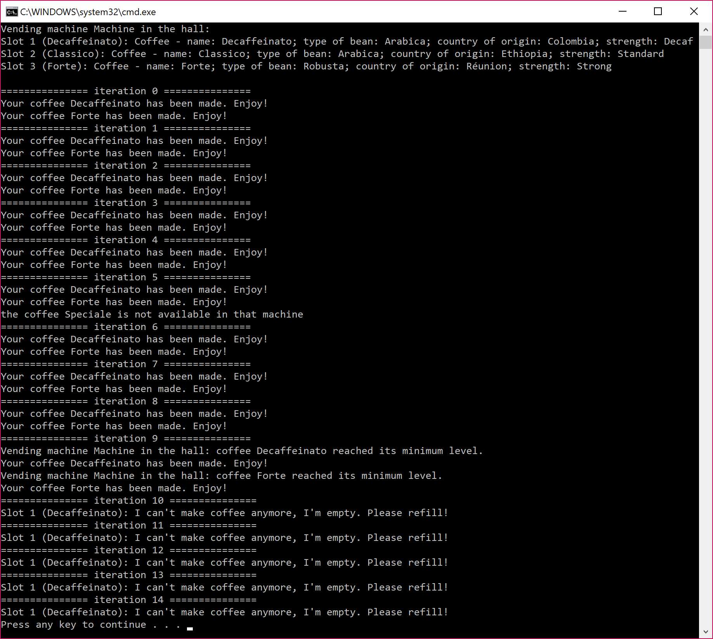
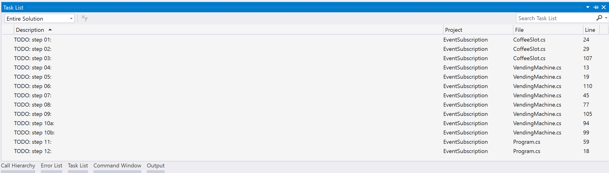

# Event management exercice: the coffee machine
The goal of this exercice is to complete an existing project to achieve basic communication with events between entities of a coffee machine.  
The basic operations are described there: [event management operation](../../docs/readme.md).
## Work
The final goal is to obtain this output without modifying the *Program.cs* (further than the *TODO*'s):  

### Steps
The project is working "out of the box". The models are created and it only miss the event management.  
The work is divided in 12 steps. Each step is made so that the project work throughout them, and not just at the end at the last step completed.  
The steps can be accessed directly with the *Task List* view:  


#### Step 1 and 2: create the handler and the event for a bean shortage in a slot
In the first two steps, you need to create the handler and the event used when a coffee slot is running out of coffee beans. The handler should be named *OutOfBeansHandler* and the event *OutOfBeans*.  
The event doesn't need to transmit data; however, use the "classic" template for the handler signature.

#### Step 3: raise the event OutOfBeans when there is a coffee beans shortage
In the same class, in the method *UseBeans*, if the current stock level of beans reached its mininum level, raise the event *OutOfBeans*. The event should be sent without data.

#### Step 4 and 5: update the class for custom arguments
Update the class *VendingMachineNotificationEventArgs* so that it can be used as an event argument.  
This class only need one argument: the message that the vending machine will be sending to the user.

#### Step 6 and 7: create the handler and the event for a vending machine notification
In the class *VendingMachine*, create the handler and the event used when the vending machine needs to inform the user of something. The handler should be named *VendingMachineNotificationHandler* and the event *VendingMachineNotification*.  
The handler should use the *VendingMachineNotificationEventArgs* as argument.

#### Step 8: create the method to handle the event OutOfBeans raised by a coffee slot
This method should do two things:
* be able to handle the *OutOfBeans* event;
* raise the event *VendingMachineNotification* with a message indicating that the coffee slot reached its minimum level.

#### Step 9: subscribe to each coffee slot OutOfBeans event
Using the correct method to handle the *OutOfBeans* event, subscribe to all coffee slots *OutOfBeans* event in the setter for *CoffeeSlots*.

#### Step 10: subscribe to the OutOfBeans event when a coffee slot is added
In the method *AddCoffeeSlot*, subscribe to the *OutOfBeans* event of the newly added coffee slot.

#### Step 11: notify the user when a coffee is not available
In the method *MakeCoffee*, if the desired coffee is not available, raise the event *VendingMachineNotification* to inform the user that the coffee they asked for is not available.

#### Step 12: inform the user when their coffee is made or if it couldn't because of a bean's shortage
If the coffee couldn't be made because of a bean's shortage, inform the user by raising the event *VendingMachineNotification* and relaying the exception message.
If the coffee was correctly made, inform the user by raising the event *VendingMachineNotification* with a useful message.

#### Step 13: create the method to handle the event VendingMachineNotification
In the class *Program*, create a method named *HandleVendingMachineNotification* that can handle the event *VendingMachineNotification* from a *VendingMachine*. This method should display to the console the message contained in the event.

#### Step 14: subscribe to the event VendingMachineNotification
In the *Main* method, subscribe to the event *VendingMachineNotification* from the newly instanciated *machine*, with the correct handler.

### Going further
#### Delegate to handle event
In this exercice, we used delegate that we created to handle event (*OutOfBeansHandler* and *VendingMachineNotificationHandler*). However, the *.NET Framework* already provides delegates for that.  
Can you use them for the following cases:
1. an event that will not provide data:
```
public delegate void OutOfBeansHandler(object sender, EventArgs e);
public event OutOfBeansHandler OutOfBeans;
```
1. an event that will provide data:
```
public delegate void VendingMachineNotificationHandler(object sender, VendingMachineNotificationEventArgs e);
public event VendingMachineNotificationHandler VendingMachineNotification;
```

#### Checking the nullity of an event before raising it
Consider the following code (which is the recommended approach to raise an event):
```
OutOfBeansHandler handler = OutOfBeans;
if (handler != null)
{
       handler(this, EventArgs.Empty)
}
```
Which can also be written (starting with C# 6):
```
OutOfBeans?.Invoke(this, EventArgs.Empty);
```

1. Why do we have to check the nullity of an event before raising it?
1. In the first scenario, why do we have to locally copy the event?
