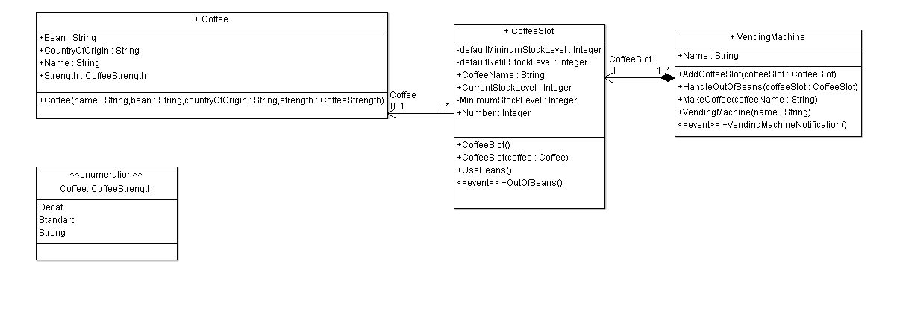

# Event Management
## Introduction
This project is a simple exercice allowing to understand how events work in C#.  
The subject is the study of a vending machine, more specifically a coffee machine: a coffee machine can makes coffee from different beans, alerts the customer if a slot is empty, when his coffee is being done or when his coffee is ready.  
The goal of the exercice is to modelise each entity and to use events to make them communicate.  
## Macro view
The main entity is the vending machine.  
The vending machine contains different slots (multiple slots per vending machine).  
Each slot contain a type of coffee bean (only one type per slot). 
The UML diagram can be represented like this:  

The main purpose of the coffee machine is to... make coffee! The method *MakeCoffee* does that; it takes the name of the coffee to prepare as the only parameter.

## Operation and use cases
### Use case 1: the coffee can be made
The simplest use case is the following:
* a customer orders a coffee; the method *MakeCoffee* is invoked, with the coffee desired;
* the correct coffee slot makes the coffee via the method *UseBeans*;
* the *CurrentStockLevel* for the coffee slot is decreased;
* the vending machine informs the customer that its coffee is ready, via the event *VendingMachineNotification*.

### Use case 2: the coffee can be made, but reached its minimum level
In that case, the customer orders a coffee but it's the last dose that the slot has:
* a customer orders a coffee; the method *MakeCoffee* is invoked, with the coffee desired;
* the correct coffee slot makes the coffee via the method *UseBeans*;
* the *CurrentStockLevel* for the coffee slot is decreased;
* it then checks if with this dose, it reached its minimum level. If that's the case, the event *OutOfBeans* is raised and processed with the coffee machine via the method *HandleOutOfBeans*;
* the vending machine informs the customer that their coffee is ready, via the event *VendingMachineNotification*.

### Use case 3: the coffee can't be made because there is not coffee
In that case, there is not enough coffee remaining in the slot and the coffee can't be made:
* a customer orders a coffee; the method *MakeCoffee* is invoked, with the coffee desired;
* the corret coffee slot invoke the method *MakeCoffee*; the *CurrentStockLevel* is not greater than *MinimumStockLevel* and the custom exception *OutOfBeansException* is raised;
* the *OutOfBeansException* is catched by the vending machine;
* the vending machine informs the customer via the event *VendingMachineNotification* that their coffee cannot be made because the slot is empty.

### Use case 4: the coffee can't be made because it doesn't exist in the vending machine
This case should not exists in real life because the vending machine would only suggest existing coffee:
* a customer orders a coffee;
* the vending machine checks that it contains this coffee;
* the coffee isn't in the list of the vending machine's coffee: the vending machine informs the customer via the event *VendingMachineNotification* that the coffee cannot be made because this type of coffee is not available.
